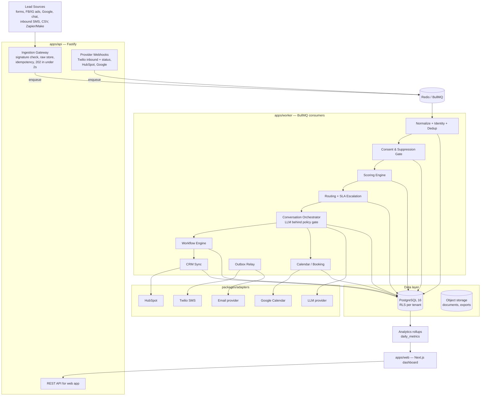

# System Architecture

## 1. Architecture assessment

The repository is empty; there is nothing to migrate or work around. That is an
advantage: we can enforce the event-driven, outbox-based design from commit one
instead of retrofitting it.

The dominant architectural risks for this product are **not** feature complexity —
they are:

1. **Duplicate side effects.** Webhooks and queues deliver at-least-once. A duplicate
   first SMS to a consumer is a compliance and brand incident, not a bug.
2. **Compliance non-determinism.** Any path where an LLM output can reach a phone
   number without passing a deterministic policy gate is a design defect.
3. **Cross-tenant leakage.** One leaked lead between roofing companies in the same
   metro ends the business.
4. **Silent failure.** A lead that never gets a first touch because a job died
   invisibly destroys the core promise.

Every structural decision below exists to kill one of those four risks.

## 2. High-level component diagram



Key rule embodied above: **webhook handlers never do business work.** They verify,
persist raw, record idempotency, enqueue, and acknowledge. Everything else happens in
the worker.

## 3. Monorepo layout

pnpm workspaces + Turborepo. TypeScript everywhere, `strict: true`.

```text
.
├── apps/
│   ├── web/                  # Next.js (App Router) dashboard + admin UI
│   │   └── src/app/          # route groups: (auth), (dashboard), (settings)
│   ├── api/                  # Fastify: public REST + ingestion + provider webhooks
│   │   └── src/
│   │       ├── routes/       # ingest/, webhooks/, v1/
│   │       ├── plugins/      # auth, rls-context, rate-limit, error-handler
│   │       └── server.ts
│   └── worker/               # BullMQ processors, schedulers, outbox relay
│       └── src/
│           ├── processors/   # one file per queue
│           ├── schedulers/   # repeatable jobs (decay, rollups, reminders)
│           └── main.ts
├── packages/
│   ├── core/                 # domain: entities, zod schemas, state machine,
│   │   └── src/              # scoring engine, routing engine, policy gate,
│   │                         # workflow definitions — ZERO I/O, pure functions
│   ├── db/                   # drizzle schema, migrations, RLS policies, seed
│   ├── queue/                # queue names, job payload types, enqueue helpers
│   ├── adapters/
│   │   ├── messaging-twilio/
│   │   ├── email-resend/     # or postmark; behind EmailChannel interface
│   │   ├── calendar-google/
│   │   ├── crm-hubspot/
│   │   └── llm-anthropic/
│   ├── config/               # zod-validated env loading (fail fast)
│   ├── logger/               # pino setup, PII redaction, correlation IDs
│   └── testing/              # factories, fake adapters, test containers
├── docs/
├── docker-compose.yml        # postgres, redis, mailpit, apps
├── turbo.json
└── package.json
```

**The load-bearing convention:** `packages/core` contains all business rules as pure
functions with no I/O. Scoring, routing, the policy gate, state transitions, and
workflow evaluation are all deterministic and unit-testable without a database. Apps
and workers are thin shells that wire core logic to storage, queues, and adapters.

## 4. Stack decisions

| Concern | Choice | Rationale / rejected alternatives |
|---|---|---|
| Language | TypeScript, strict | Directive requirement; one language across web/api/worker |
| Monorepo | pnpm + Turborepo | Simple, fast, no build-graph exotica needed |
| Web | Next.js (current stable, App Router) | Directive; server components fit dashboard reads |
| API service | **Fastify** | Separate from Next.js so webhook latency is independent of dashboard deploys; schema-driven validation; faster than Express. Rejected: API routes inside Next.js (couples ingest SLO to frontend), NestJS (ceremony without payoff at this size) |
| Worker | Node + BullMQ | Durable delayed jobs, retries/backoff, DLQ patterns, repeatable jobs — matches follow-up + escalation needs exactly. Rejected: Temporal (better semantics, too much operational weight for MVP; adapter-friendly to adopt later) |
| Database | PostgreSQL 16 | RLS for tenant isolation, transactional outbox, unique constraints as idempotency backstop |
| ORM | **Drizzle** | SQL-first: we need precise control for RLS session variables, partial unique indexes, `FOR UPDATE SKIP LOCKED` outbox polling. Rejected: Prisma (RLS + advanced SQL awkward) |
| Cache/queue | Redis 7 | BullMQ backing, slot-hold TTLs, rate-limit counters |
| Validation | Zod | Env, API payloads, LLM output, workflow definitions — one library |
| Auth | better-auth (organization plugin) | Sessions + orgs + RBAC hooks without a SaaS dependency. Rejected: Clerk/Auth0 (external PII processor before we need one) |
| SMS | Twilio (behind `MessageChannel`) | Directive; A2P 10DLC path documented |
| Email | Resend or Postmark (behind `EmailChannel`) | Commodity; decide at M3 by deliverability test |
| Calendar | Google Calendar API (freebusy + events) | Directive |
| CRM | HubSpot (behind `CrmAdapter`) | Directive; GoHighLevel second |
| LLM | Anthropic API (behind `LlmProvider`) | Structured output + tool allowlisting; provider swappable by design |
| Logging | pino + redaction | Structured JSON, PII masking at the logger boundary |
| Errors/monitoring | Sentry + OpenTelemetry traces | Correlation IDs: request → job → provider call |
| Tests | Vitest + Testcontainers + Playwright | Unit (core), integration (real Postgres/Redis), E2E (web) |
| Dev env | Docker Compose | One-command bring-up |

Version policy: current stable production releases at implementation time; exact pins
recorded in the lockfile, not in docs.

## 5. Event-driven backbone

### 5.1 Domain events

All state changes emit immutable rows into `lead_events` (append-only, timestamped,
tenant-scoped). Analytics reads events, never mutable rows.

```text
lead.received          lead.normalized        lead.duplicate_detected
lead.scored            lead.assigned          lead.qualified
lead.opted_out         lead.state_changed
message.requested      message.sent           message.delivered
message.failed         message.received
appointment.offered    appointment.booked     appointment.cancelled
appointment.no_show
human.takeover_started human.takeover_ended
crm.synced             crm.sync_failed
deal.won               deal.lost
workflow.started       workflow.step_completed workflow.failed
```

### 5.2 Queue topology (BullMQ)

| Queue | Purpose | Notes |
|---|---|---|
| `ingest` | raw webhook → normalized lead | idempotency-keyed job IDs |
| `first-touch` | compose + gate + enqueue first response | highest priority |
| `messaging-out` | outbox relay → provider send | per-tenant rate limiting |
| `messaging-events` | delivery callbacks, inbound messages | |
| `conversation` | LLM orchestration per inbound message | per-lead FIFO via job groups |
| `workflow` | delayed workflow steps | delayed jobs; cancellation on stop conditions |
| `escalation` | SLA ladder timers | cancelled on acknowledgment |
| `crm-sync` | HubSpot jobs | circuit breaker on provider outage |
| `calendar` | booking, reminders | |
| `rollup` | daily metrics, score decay | repeatable/cron |
| `*:dlq` | dead letters per queue | admin UI: inspect, retry, discard |

### 5.3 Reliability patterns (all mandatory)

- **Idempotency keys** at ingestion (`external_event_id` / payload hash) and on every
  side-effecting job (deterministic BullMQ job IDs).
- **Transactional outbox** for every outbound message and CRM mutation: intent row is
  committed atomically with domain state; relay polls with
  `FOR UPDATE SKIP LOCKED`; provider send marks the row. Crash between commit and
  send → relay retries; crash after send → provider-side idempotency
  (Twilio idempotent create where available, else dedupe_key check before send).
- **Unique DB constraints as final backstop**: e.g. one `first_touch` message per
  lead, one active slot hold per calendar slot, one consent-revocation processing
  per (lead, channel).
- **Retries with exponential backoff + jitter**; bounded attempts; then DLQ.
- **Webhook signature verification** on every inbound endpoint (Twilio
  `X-Twilio-Signature`, HubSpot v3 signatures, HMAC for generic ingest) plus
  timestamp-window replay rejection.
- **Circuit breakers** per provider adapter; open circuit → jobs parked, health
  screen shows degradation, nothing lost.
- **Explicit timeouts** on all provider calls; **workflow step timeouts** so no run
  hangs forever.
- **Out-of-order tolerance**: delivery events upsert by provider message SID +
  status precedence (e.g. `delivered` never regresses to `sent`).
- **Replayability**: raw webhooks stored verbatim; an admin can re-drive
  normalization from raw payloads after a bug fix.

## 6. Request lifecycles

### 6.1 Ingestion (target: ack < 2s)

```text
POST /v1/ingest/:sourceKey
  → verify HMAC signature + timestamp window
  → insert raw_webhooks row (verbatim payload)
  → upsert idempotency record; duplicate? → 202 (acknowledged, not reprocessed)
  → enqueue ingest job (job ID = idempotency key)
  → 202 Accepted
```

### 6.2 First touch (target: < 30s end-to-end)

```text
ingest job: normalize → identity resolution → create/merge lead
  → emit lead.received / lead.normalized
  → consent + suppression gate (deterministic; fail → nurture-only or hold)
  → score → band → route/assign → escalation timers if Hot
  → compose first-touch from template (personalization variables)
  → policy gate (quiet hours? consent channel? dedupe constraint?)
  → outbox row committed with lead state change
  → relay → Twilio send → status callbacks update delivery state
```

### 6.3 Inbound reply

```text
Twilio webhook → signature check → store → enqueue messaging-events
  → match conversation by (tenant sender, lead phone)
  → deterministic scan: STOP keywords → opt-out path (bypasses LLM entirely)
  → conversation job → orchestrator (see conversation-engine.md)
  → proposed action → policy gate → outbox / state change / human alert
```

## 7. Observability

- **Correlation ID** minted at ingestion, propagated through every job, provider
  call, and audit row: one lead's full journey is a single trace query.
- Structured logs always carry `tenant_id`, `lead_id`, `correlation_id`,
  `workflow_run_id` where applicable; PII (phone, email, message bodies) redacted at
  the pino serializer level.
- Metrics: queue depth/age per queue, job failure rates, provider latency,
  first-touch latency histogram (this *is* the product SLO), opt-out processing
  latency.
- Health: `/healthz` (liveness), `/readyz` (DB + Redis + adapter probes); worker
  heartbeats surfaced on the System Health page.
- Alerting thresholds (pilot): DLQ > 0 for 5 min, first-touch p95 > 90s,
  opt-out processing > 5s, any circuit breaker open.

## 8. Environments & CI/CD

- **Local:** Docker Compose; mailpit for email; Twilio test credentials; fake
  adapters available via env flag for offline dev.
- **Staging:** mirrors production topology; Twilio test numbers; HubSpot sandbox
  portal; seeded golden dataset.
- **Production:** managed Postgres (PITR backups) + managed Redis; secrets in cloud
  secret manager; blue/green or rolling deploys; migrations run as a gated step.
- **CI (every push):** typecheck → lint → unit (core) → integration
  (Testcontainers Postgres/Redis) → migration drift check → build. E2E (Playwright)
  on main and release branches.
