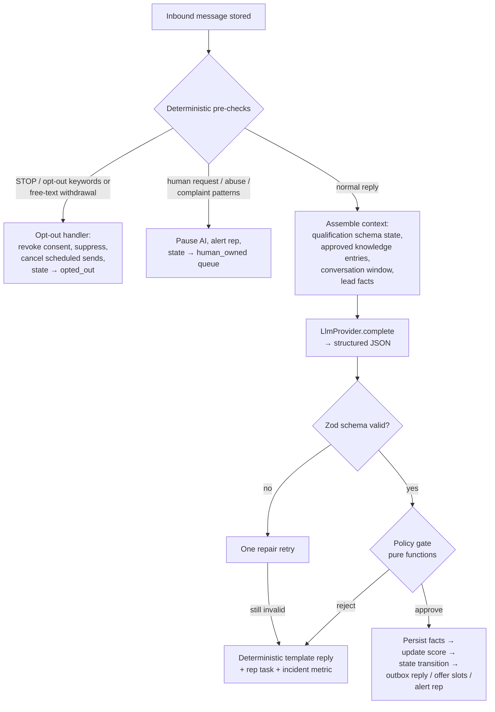

# Conversation Engine — AI Qualification with a Deterministic Policy Gate

The single most important design rule in the product:

> **The LLM interprets and drafts. The application decides and sends.**

No code path may deliver LLM output to a lead, change consent, alter state, or touch
an external system without passing the deterministic policy gate.

## 1. Orchestration loop (runs per inbound message)



Per-lead FIFO processing (queue job groups) so two rapid replies never produce
interleaved, contradictory agent turns.

## 2. Structured LLM output contract

```ts
const AgentTurn = z.object({
  extracted_facts: z.object({
    service: z.enum(ROOFING_HVAC_SERVICES).nullable(),
    urgency: z.enum(['emergency', 'high', 'medium', 'low']).nullable(),
    property_type: z.enum(['single_family','multi_family','commercial','other']).nullable(),
    location_confirmed: z.boolean().nullable(),
    insurance_claim: z.boolean().nullable(),
    timeline: z.string().nullable(),
    appointment_intent: z.boolean().nullable(),
  }).partial(),
  detected_intents: z.array(z.enum([
    'question_pricing','question_faq','wants_appointment','wants_human',
    'dissatisfied','possible_opt_out','off_topic','objection',
  ])),
  proposed_reply: z.string().max(560),
  knowledge_refs: z.array(z.string()),   // IDs of knowledge entries the reply relies on
  needs_clarification: z.boolean(),
  internal_summary: z.string().max(400),
  confidence: z.number().min(0).max(1),
});
```

`knowledge_refs` is load-bearing: the gate verifies every factual claim category in
the reply is backed by a cited approved entry (see §3.4).

## 3. Policy gate (pure functions in `packages/core`, exhaustively unit-tested)

Evaluated in order; first failure wins and is recorded in
`messages.policy_snapshot`:

1. **Consent & suppression re-check** — current consent for the channel, no
   suppression hit. (Re-checked at send time too; the gate is not the last line.)
2. **Opt-out double-check** — if the LLM flagged `possible_opt_out`, the
   deterministic detector re-runs; ambiguity resolves toward *treating it as
   opt-out* and asking nothing further.
3. **Quiet hours** — reply scheduled to next allowed window if outside.
4. **Follow-up caps** — max automated messages per lead per day/week per tenant
   config; hard platform ceiling above tenant settings.
5. **Claim verification** — proposed reply is scanned for pricing patterns
   (currency, numbers + duration), guarantees ("we guarantee", "promise"),
   discounts, availability commitments, and legal/medical phrasing. Any hit must be
   backed by a `knowledge_refs` entry of the matching type; otherwise the reply is
   rejected and replaced with the approved uncertainty response:
   *"A specialist will confirm that for you."* + rep task.
6. **Tool allowlist** — the turn may only trigger actions from:
   `send_reply`, `offer_slots`, `alert_rep`, `create_task`, `update_facts`.
   Anything else in a proposed action is rejected and audited. There is no generic
   tool-execution surface; the LLM literally has no other verbs.
7. **State validity** — resulting transition must be legal in the state machine.

The gate never calls the network, never reads the clock ambiguously (clock is
injected), and is property-tested with adversarial inputs.

## 4. What the LLM can never do (enforced structurally, not by prompt)

- Decide whether consent exists (it never sees consent data).
- Override an opt-out (opt-out path bypasses the LLM entirely).
- Send anything directly (only the outbox relay sends; only the gate writes outbox).
- Invent pricing/discounts/guarantees (claim verification).
- See another tenant's data (context assembly runs under RLS; knowledge entries are
  tenant-scoped rows).
- Exceed follow-up caps (deterministic counters).

Prompt-injection defense in depth: lead messages are wrapped in delimited untrusted
blocks in the prompt; system prompt instructs the model to treat them as data; but
the real defense is that **even a fully hijacked model output can only propose
allowlisted actions that still pass the gate**. A hijack can at worst produce an
off-topic reply that claim-verification and reply-length rules constrain.

## 5. Knowledge base

- `knowledge_entries`: tenant-scoped, typed (`service`, `service_area`, `hours`,
  `pricing_guidance`, `financing`, `warranty`, `faq`, `exclusion`,
  `escalation_rule`, `promotion`), versioned, with `approved_by` + `approved_at`.
  Only approved versions enter prompts.
- MVP retrieval: all approved entries for the tenant fit in context (tens of
  entries); no vector store needed. Embedding-based retrieval is a Phase-3 concern
  if entry counts grow.
- Promotions carry validity windows; expired promotions are excluded from context
  assembly automatically (deterministic, not model-judged).

## 6. Qualification schemas

- `qualification_schemas`: ordered field definitions with types, allowed values,
  required flags, and per-field question hints. The orchestrator (not the LLM)
  selects the next unanswered required field; the LLM phrases the question
  naturally and interprets the answer.
- Roofing/HVAC v1 schema: `service`, `urgency`, `property_type`,
  `location_confirmed`, `insurance_claim`, `timeline`, `appointment_intent`.
- Completion rule: all required fields answered → `lead.qualified` event → scoring
  re-run → booking offer if band permits.

## 7. Human takeover interplay

- Takeover sets `human_owned`; the conversation queue drops (not defers) AI jobs
  for that lead; inbound messages still record and notify the owning rep.
- The takeover card shows: AI `internal_summary`, qualification field grid, score
  breakdown, suggested next action, and full timeline.
- Resume re-enables the orchestrator from current state; the workflow engine
  re-evaluates which sequence (if any) applies.

## 8. Audit & cost

- Every LLM call → `ai_interactions` row: prompt hash, context entry IDs, raw
  response, parsed output, gate verdict, token usage, latency, correlation ID.
  Bodies stored under the tenant's retention policy with PII controls.
- Per-tenant token budgets with soft alerts; usage surfaces on the executive
  dashboard as "automation cost" feeding the ROI formula.
