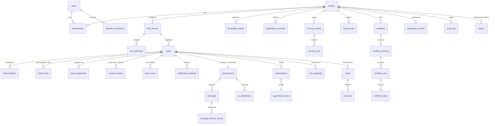
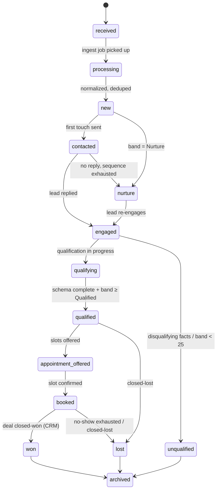

# Data Model

PostgreSQL 16, Drizzle ORM migrations. Every operational table carries `tenant_id`
and is covered by row-level security (§5). All timestamps are `timestamptz`. Primary
keys are UUIDv7 (time-ordered, index-friendly).

## 1. Entity groups

| Group | Tables |
|---|---|
| Tenancy & access | `tenants`, `users`, `memberships`, `roles`, `tenant_settings`, `teams` |
| Ingestion | `lead_sources`, `raw_webhooks`, `ingest_idempotency` |
| Leads | `leads`, `lead_identities`, `lead_events`, `lead_assignments` |
| Compliance | `consent_records`, `suppression_entries` |
| Conversation | `conversations`, `messages`, `message_delivery_events`, `message_templates`, `ai_interactions` |
| Knowledge & qualification | `knowledge_entries`, `qualification_schemas`, `qualification_answers` |
| Scoring | `scoring_models`, `scoring_rules`, `lead_scores` |
| Routing | `routing_rules`, `territories`, `user_schedules` |
| Workflows | `workflows`, `workflow_versions`, `workflow_runs`, `workflow_steps` |
| Scheduling | `appointment_types`, `appointments`, `calendar_connections`, `slot_holds` |
| CRM | `crm_connections`, `crm_mappings`, `crm_sync_jobs`, `deals`, `outcomes` |
| Reliability | `outbox` |
| Audit & metrics | `audit_logs`, `usage_records`, `daily_metrics` |

## 2. Entity-relationship diagram (core paths)



## 3. Key table definitions (abridged to decision-relevant columns)

### leads

```text
id, tenant_id, source_id, state (enum, see §4), first_name, last_name,
email_normalized, phone_e164, address, city, region, postal_code, location_point,
service_requested, property_type, urgency, is_existing_customer,
score_current, score_band, assigned_user_id,
external_ids jsonb, custom_fields jsonb,
first_touch_at, first_reply_at, qualified_at, booked_at,
created_at, updated_at
-- UNIQUE partial index: (tenant_id, phone_e164) WHERE state NOT IN ('archived','lost','won')
--   → open-lead dedup enforced by the database, not just code
```

### lead_events (append-only; the analytics source of truth)

```text
id, tenant_id, lead_id, type, payload jsonb, correlation_id, actor
  (system|user_id|workflow_run_id), occurred_at
-- No UPDATE/DELETE grants for the app role. Response-time metrics computed from
-- lead.received → message.sent deltas here, never from mutable lead columns.
```

### consent_records (ledger, never overwritten)

```text
id, tenant_id, lead_id, channel (sms|email|whatsapp|voice), status
  (granted|revoked|unknown), consent_source, disclosure_text_version,
source_url_or_form_id, ip_address, external_evidence jsonb,
captured_at, revoked_at, revocation_method
-- Current consent = latest row per (lead, channel). Revocation appends; history kept.
```

### messages + outbox

```text
messages: id, tenant_id, conversation_id, direction (in|out), channel, body,
  template_key, dedupe_key, provider_sid, status
  (queued|sent|delivered|failed|received), policy_snapshot jsonb
  (what the gate approved and why), created_at
-- UNIQUE (tenant_id, conversation_id, dedupe_key) → no duplicate first-touch, ever.

outbox: id, tenant_id, aggregate_type, aggregate_id, intent_type, payload jsonb,
  status (pending|dispatched|failed), attempts, next_attempt_at, created_at
-- Written in the SAME transaction as the domain change. Relay polls with
-- FOR UPDATE SKIP LOCKED.
```

### lead_scores (explainability built in)

```text
id, tenant_id, lead_id, model_version, total, band, breakdown jsonb
  -- e.g. [{"rule":"service_area_match","points":20}, {"rule":"urgent_leak","points":20}, ...]
, triggered_by_event_id, created_at
```

### slot_holds (booking concurrency guard)

```text
id, tenant_id, calendar_connection_id, starts_at, ends_at, lead_id,
expires_at, status (held|confirmed|released)
-- UNIQUE (calendar_connection_id, starts_at) WHERE status IN ('held','confirmed')
-- Hold TTL enforced by expiry sweep; booking = hold → confirm → calendar event,
-- all or nothing.
```

### workflow_runs / workflow_steps

```text
workflow_runs: id, tenant_id, workflow_version_id, lead_id, trigger_event_id,
  status (running|completed|stopped|failed), stop_reason, started_at, ended_at
workflow_steps: id, run_id, step_key, action_type, status, input jsonb,
  output jsonb, error, scheduled_for, executed_at
-- Every step persisted → "no workflow silently disappears" is queryable.
```

### audit_logs

```text
id, tenant_id, actor_type (user|system|ai|integration), actor_id, action,
entity_type, entity_id, before jsonb, after jsonb, correlation_id, ip, created_at
-- Written in-transaction via auditedAction() helper. Append-only.
```

## 4. Lead state machine

States: `received, processing, new, contacted, engaged, qualifying, qualified,
appointment_offered, booked, human_owned, nurture, unqualified, opted_out, won,
lost, archived`.



Cross-cutting transitions (allowed from any active state):
- `→ human_owned` on takeover; `human_owned → previous state` on resume.
- `→ opted_out` on opt-out. **Terminal for automation**; only manual, documented
  re-consent can exit it.

Implementation: a transition table in `packages/core` —
`canTransition(from, to, context): Result`. Invalid transitions throw, are audited,
and increment an alert metric. All transitions emit `lead.state_changed` events.

## 5. Tenant isolation strategy

Defense in depth — three layers, each sufficient to stop a leak alone:

1. **Row-level security (primary).** Every tenant-scoped table:

   ```sql
   ALTER TABLE leads ENABLE ROW LEVEL SECURITY;
   CREATE POLICY tenant_isolation ON leads
     USING (tenant_id = current_setting('app.tenant_id')::uuid);
   ```

   The API/worker DB role is **not** `BYPASSRLS`. Every request/job wraps its work in
   a transaction that first executes
   `SET LOCAL app.tenant_id = $1` (via a repository helper — raw connection access is
   lint-banned outside `packages/db`). No setting → no rows.

2. **Application scoping.** Repository layer requires a `TenantContext` argument on
   every query function; the type system makes tenant-less queries uncompilable.

3. **Test enforcement.** The tenant-isolation suite (M1, run forever after) attempts
   cross-tenant access through every API route and through deliberately buggy
   repository calls; the DB layer must reject all of them.

Platform-admin access uses a separate role with explicit, audited elevation — never
default-on bypass.

## 6. Data lifecycle & retention

- `raw_webhooks`: 90 days default (configurable per tenant), then purged; retained
  long enough for replay/debugging.
- `messages`, `ai_interactions`: tenant-configurable retention; bodies encrypted at
  rest; export + deletion workflows operate at the lead level (deletion cascades
  with tombstone audit entry, consent/suppression records retained as legal basis).
- `lead_events`, `audit_logs`: append-only, long retention (attribution and
  compliance evidence).
- `suppression_entries`: **never auto-purged** — deleting them recreates the
  contact-after-opt-out risk.
- Backups: PITR on managed Postgres; restore drill in M11.

## 7. Migration & seed discipline

- Drizzle migrations are forward-only in shared environments; every migration PR
  includes the drift check in CI.
- Seed data (`packages/db/seed`): demo tenant "Summit Roofing", five users (one per
  role), roofing/HVAC scoring model + qualification schema + message templates +
  default workflows, one golden-dataset scenario with known expected metrics (used
  by the analytics acceptance test in M10).
